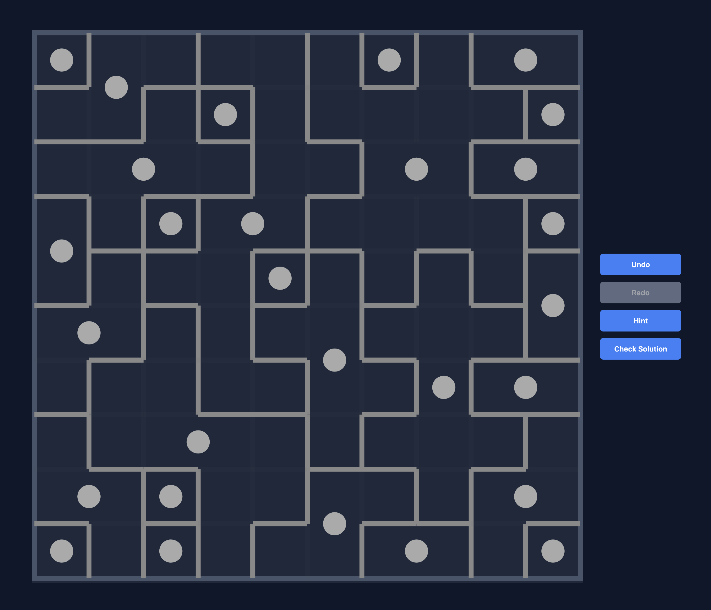

# How to Play

Laniakea is a puzzle game. The goal is to divide a grid into several regions, called galaxies, based on the positions of given centers.

## Example Solution

## The Rules

### 1. One Center per Galaxy
Each galaxy must contain exactly **one** center (the dot). You cannot have a galaxy without a center, nor can you have a galaxy with multiple centers.

### 2. Rotational Symmetry
Every galaxy must be **rotationally symmetric** (180 degrees) around its center. 
- If you imagine rotating the galaxy 180 degrees around its dot, it should look exactly the same and cover the same cells.
- This means that for every cell in a galaxy, the "mirror image" cell (on the opposite side of the dot) must also be in that same galaxy.

### 3. No Gaps
Every single cell on the board must be part of a galaxy. There should be no "homeless" cells when the puzzle is solved.

### 4. No Dangling Borders
Every boundary line should either connect to another line or the edge of the board.

Happy puzzling!
